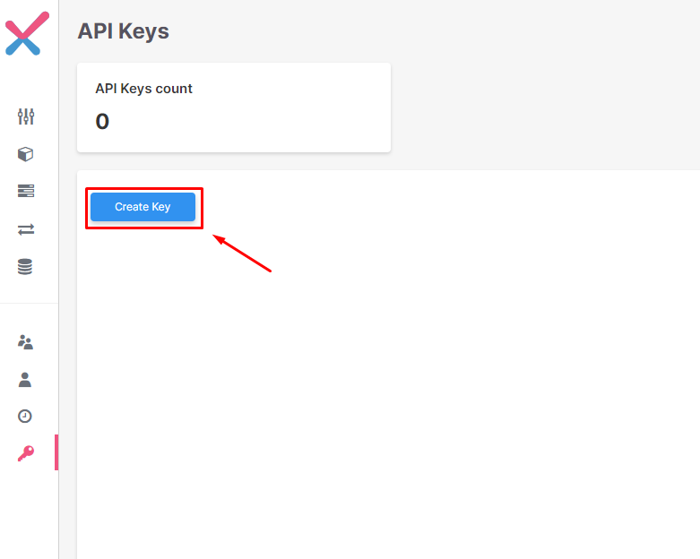

# Checkmarx DAST GitHub Action

[](https://www.gnu.org/licenses)

- [Checkmarx DAST GitHub Action](#checkmarx-dast-github-action)
  - [Integrate DAST into your GitHub workflows](#integrate-checkmarx-dast-into-your-github-workflows)
    - [Authentication with Checkmarx One Servers](#authentication)
  - [Inputs](#inputs)
  - [Simple usage example](#simple-usage-example)

## Integrate Checkmarx DAST into your GitHub workflows

You can integrate DAST into your GitHub Actions CI/CD pipelines.
This provides you the ability to run DAST scans in your GitHub repositories.

### Authentication

Checkmarx DAST CLI Authentication is made through Checkmarx One API Key
To Generate an API Key follow these steps:

1. Go to Identity and Access Management

   

2. Go to API Keys

   

3. Create a new API Key

   

4. Copy the Generated Key

    

5. Create a GitHub action runner secret from the key generated in point 4

   

6. Set the enviornment variable `CX_APIKEY` to you newly created secret

```yaml
steps:
    - name: Run Checkmarx DAST Scan
      uses: checkmarx/dast-github-action@v1.0
      env:
        CX_APIKEY: ${{ secrets.CX_ONE_API_KEY }}
```

## Inputs

| Variable 	        | Example Value 	                         | Description 	                                                                   | Required                  |
|-------------------|-----------------------------------------|---------------------------------------------------------------------------------|---------------------------|
| command           | web      	                              | The type of scan to preform (web, api)                                          | true                      |
| config            | ./zap_config.yaml                       | The path to the ZAP configuration file                                          | true                      |
 | base_url          | localhost.cxast.net                     | The baseURL for the Checkmarx One application                                           | true                      |
| environment_id    | c608a51a-ec4e-4eef-81c4-a0241737efd7  	 | The environment ID retrieved from DAST in CxOne	                                | true                      |
| openapi  	        | 	           ./swagger.yaml              | The path to the openapi specification file 	                                    | true (only for api scan)  |
| project_id 	      | fd093dde-b64a-466f-b2cd-8bf141b4db94	   | The project ID retrieved from project tab in Checkmarx One  	                           | false (only for api scan) |
| output	           | 	 ./output                              | The path to generate the output files (zap log and original results) 	          | false                     |
| timeout 	         | 10000 	                                 | The zap engine timeout in seconds (default: 300) 	                              | false                     |
| update_interval 	 | 	 10                                    | The interval in which to log the progress of the scan in seconds (default: 10) 	 | false                     |
| jvm_properties 	  | -Xmx512m   	                            | 	The jvm properties used in the ZAP engine (default: -Xmx3G)                    | false                     |
| log_level 	       | info   	                                | The level on what DAST will log (default: info)	                                | false                     |
| 	verbose          | 	 true                                  | Set to true in order to print the logs to the stdout (default: false)	          | false                     |
| fail_on 	         | high 	                                  | 	The minimum severity in which the action should fail                           | false                     |
| retry	            | 3 	                                     | Retry requests to AST on connection failure (default: 3)	                       | false                     |
| retry_delay	      | 	  20                                   | 	Time between retries in seconds, use with retry (default: 20)                  | false                     |

## Simple Usage Example

### Web Scan

```yaml
    # Steps represent a sequence of tasks that will be executed as part of the job
    steps:
    # Checks-out your repository under $GITHUB_WORKSPACE, so your job can access it
    - uses: actions/checkout@v3
    # Scan Iac with kics
    - name: Checkmarx DAST Github Action
      uses: Checkmarx/checkmarx-dast-github-action@beta
      env:
        CX_APIKEY: ${{ secrets.CX_ONE_API_KEY }}
      with:
        command: "web"
        config: 'zap_config.yaml'
        base_url: "localhost.cxast.net"
        environment_id: "c608a51a-ec4e-4eef-81c4-a0241737efd7"
        fail_on: "HIGH"
        verbose: true
```

### API Scan

```yaml
    # Steps represent a sequence of tasks that will be executed as part of the job
    steps:
    # Checks-out your repository under $GITHUB_WORKSPACE, so your job can access it
    - uses: actions/checkout@v3
    # Scan Iac with kics
    - name: Checkmarx DAST Github Action
      uses: Checkmarx/checkmarx-dast-github-action@beta
      env:
        CX_APIKEY: ${{ secrets.CX_ONE_API_KEY }}
      with:
        command: "api"
        config: 'zap_api_config.yaml'
        base_url: "localhost.cxast.net"
        environment_id: "c608a51a-ec4e-4eef-81c4-a0241737efd7"
        openapi: "swagger.yaml"
        project_id: "fd093dde-b64a-466f-b2cd-8bf141b4db94"
        fail_on: "HIGH"
        verbose: true
```
